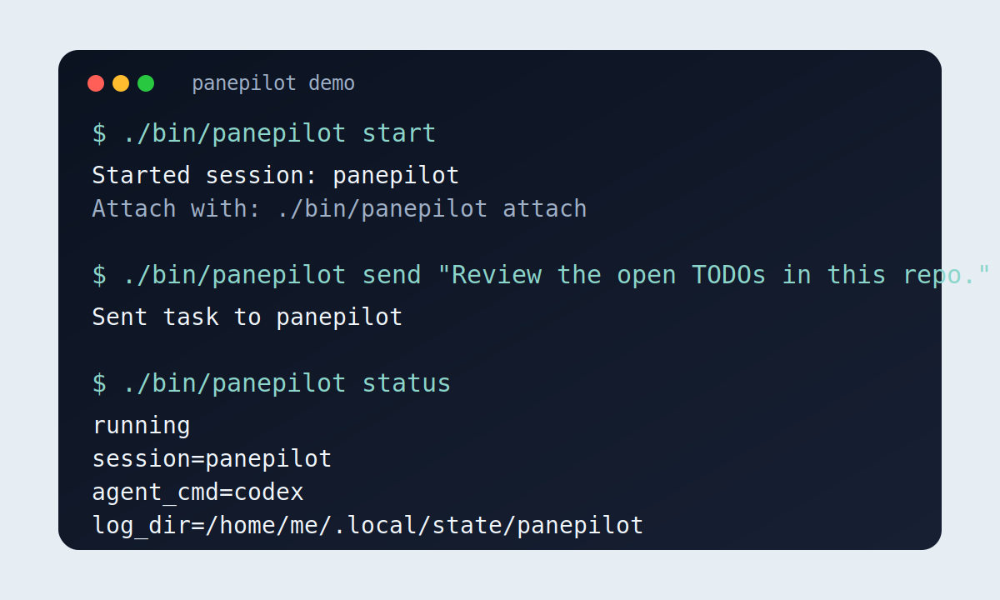

# PanePilot

[](LICENSE)

Persistent tmux workspaces for terminal-native coding agents.

PanePilot gives agent CLIs a stable operating surface: start a session once,
detach from it, reattach later, inject tasks from scripts, and keep the session
alive across terminal disconnects.

It is designed for real machines, not demo shells.



## One-line Pitch

PanePilot is the missing operational layer between a terminal coding agent and a
real long-running workspace.

## Why it exists

Most coding agents behave like interactive terminal apps, but real usage is
often longer-running than one terminal tab:

- keep a session alive while you disconnect
- send prompts without attaching to the pane
- keep one agent pinned to one workspace
- recover the session if the agent exits
- schedule recurring prompts with cron
- keep logs and local state out of the repo

PanePilot is the thin control surface around that workflow.

## Why not just tmux?

Plain tmux gives you persistence, but not operating conventions.

PanePilot adds:

- runtime-aware health checks
- ready detection
- conditional recovery instead of blind restarts
- runtime profiles for different agent CLIs
- one stable command surface for status, capture, logs, and task injection

If your answer is "I can already do this in tmux", that is true for the first
10 minutes. PanePilot exists for the third day of using the same agent workspace
on the same machine.

## What it supports

PanePilot is runtime-agnostic. If the agent exposes a terminal command, you can
run it inside the managed tmux session.

Common examples:

- `claude`
- `codex`
- `openclaw`
- custom wrapper scripts such as `bin/my-agent`

Validated profiles currently included:

| Runtime | Profile | Validation status |
| --- | --- | --- |
| Codex | `examples/codex.env` | verified |
| OpenClaw | `examples/openclaw.env` | verified |
| Claude | `examples/claude.env` | template only |

See `docs/runtimes.md` for runtime-specific notes.

## Quick Start

```bash
git clone https://github.com/Galaxy-0/panepilot.git
cd panepilot
cp config/panepilot.env.example config/panepilot.env
```

Edit `config/panepilot.env` and set at least:

- `PANEPILOT_AGENT_CMD`, for example `codex`
- `PANEPILOT_WORK_DIR`, the workspace you want the agent to run in

If your agent needs local API credentials, also set:

- `PANEPILOT_AGENT_ENV_FILE`, for example `"$HOME/.codex/crs_oai.env"`

Then start the session:

```bash
./bin/panepilot start
```

Common commands:

```bash
./bin/panepilot status
./bin/panepilot health
./bin/panepilot list
./bin/panepilot doctor
./bin/panepilot restart-if-unhealthy
./bin/panepilot wait-ready 20
./bin/panepilot attach
./bin/panepilot capture 80
./bin/panepilot logs keepalive 50
./bin/panepilot send "Review the open TODOs in this repo."
./bin/panepilot send-file ./tasks/example-nightly.md
./bin/panepilot config
```

## What it looks like

```text
$ ./bin/panepilot start
Started session: panepilot
Attach with: ./bin/panepilot attach

$ ./bin/panepilot send "Summarize the open TODOs in this repo."
Sent task to panepilot

$ ./bin/panepilot doctor
check_tmux=ok
check_agent_command=ok
session_state=ready
doctor=ok
```

## Configuration

Local configuration lives in `config/panepilot.env` and is gitignored.

Example:

```bash
PANEPILOT_AGENT_CMD="codex"
PANEPILOT_AGENT_ENV_FILE="$HOME/.codex/crs_oai.env"
PANEPILOT_PROCESS_REGEX="^(node|codex)$"
PANEPILOT_READY_REGEX="OpenAI Codex|Use /skills|100% left"
PANEPILOT_ERROR_REGEX="Missing environment variable"
PANEPILOT_WORK_DIR="$HOME/work/my-project"
PANEPILOT_SESSION="panepilot"
PANEPILOT_LOG_DIR="$HOME/.local/state/panepilot"
PANEPILOT_TASK_FILE="$HOME/work/my-project/tasks/nightly.md"
```

See:

- `config/panepilot.env.example`
- `examples/codex.env`
- `examples/claude.env`
- `examples/openclaw.env`
- `docs/runtimes.md`

Useful operational commands:

- `./bin/panepilot health` for the current runtime state
- `./bin/panepilot list` to inspect managed tmux sessions
- `./bin/panepilot doctor` to validate config, runtime command, env file, and session state
- `./bin/panepilot restart-if-unhealthy` to recover only when state is not healthy
- `./bin/panepilot wait-ready 20` to block until the pane becomes ready
- `./bin/panepilot capture 120` to inspect the current pane buffer
- `./bin/panepilot logs assistant 50` to tail PanePilot logs
- `./bin/panepilot logs keepalive 50` to inspect restart behavior

## Optional Automation

Keep the session alive and compact the context every few hours:

```bash
0 * * * * /path/to/panepilot/scripts/keepalive.sh
```

Send a nightly task prompt from a file:

```bash
0 22 * * * /path/to/panepilot/scripts/tasks/nightly.sh
```

You can use `tasks/example-nightly.md` as a starting point and copy it to your
own `tasks/nightly.md`.

## Tmux Shortcuts

- `Ctrl+b d`: detach and leave the agent running
- `Ctrl+b [`: enter scroll mode
- `q`: exit scroll mode

## FAQ

### Is this only for one agent?

One PanePilot config manages one primary session well. You can still run
multiple sessions by using different config files or tmux session names.

### Is this a replacement for a workflow engine?

No. PanePilot is intentionally small. It is not a scheduler platform, hosted
service, or multi-agent orchestrator.

### Does it require tmux expertise?

Not much. You still benefit from knowing basic tmux keys, but the day-to-day
control surface is `./bin/panepilot`, not raw tmux commands.

### What if my agent startup output is different?

Tune:

- `PANEPILOT_PROCESS_REGEX`
- `PANEPILOT_READY_REGEX`
- `PANEPILOT_ERROR_REGEX`

## Roadmap

Near-term priorities:

- stronger runtime profiles
- cleaner demo assets
- better recovery heuristics
- more battle-tested startup checks

See [ROADMAP.md](ROADMAP.md).

## Launch Assets

- `docs/demo-script.md`
- `docs/launch-post.md`
- `docs/launch/x-post.md`
- `docs/launch/reddit-post.md`
- `docs/launch/hn-post.md`

## Contributing

See [CONTRIBUTING.md](CONTRIBUTING.md).

## License

MIT
